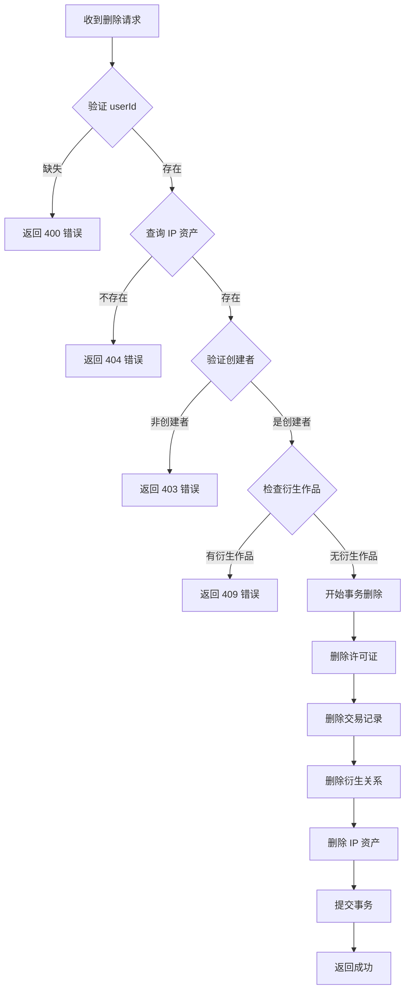

# 🗑️ IP 删除功能文档

## 功能概述

现在项目已经支持删除 IP 资产功能，包含以下特性：

- ✅ 仅创建者可以删除自己的 IP
- ✅ 级联删除相关数据（许可证、交易记录等）
- ✅ 防止删除有衍生作品的父 IP
- ✅ 确认对话框防止误操作
- ✅ 删除后自动跳转到市场浏览页

---

## 一、前端展示

### 1.1 删除按钮位置

**显示条件：**
- ✅ 用户已登录
- ✅ 用户是该 IP 的创建者

**位置：**
IP 详情页左侧栏，在收益信息卡片下方

```
┌─────────────────────────────────────┐
│  💰 Royalty Information             │
│  ...                                │
└─────────────────────────────────────┘

┌─────────────────────────────────────┐
│  🗑️ Delete IP Asset                 │  ← 红色按钮
│  Permanently remove this IP         │
└─────────────────────────────────────┘

┌─────────────────────────────────────┐
│  📊 Asset Metadata                  │
│  ...                                │
└─────────────────────────────────────┘
```

**按钮样式：**
```tsx
className="w-full py-3 bg-red-600/10 hover:bg-red-600/20 
           border border-red-500/20 text-red-400"
```

- 🔴 红色主题（半透明背景）
- 🗑️ 垃圾桶图标
- ⚠️ 悬停时背景变深

---

### 1.2 确认对话框

#### **对话框结构**

```
┌─────────────────────────────────────────────────┐
│  ⚠️ Confirm Deletion                        ✕  │  ← 红色主题头部
├─────────────────────────────────────────────────┤
│                                                 │
│  Delete "AI Portrait"?                          │
│  This will permanently remove this IP asset     │
│  and all associated data from the platform.     │
│                                                 │
│  ⚠️ Warning: This action cannot be undone.      │
│  The following will be permanently deleted:     │
│  • IP asset metadata and image                  │
│  • All associated licenses                      │
│  • Transaction history                          │
│  • Derivative relationships (if child IP)       │
│                                                 │
├─────────────────────────────────────────────────┤
│                          [Cancel] [⚠️ Delete]   │  ← 操作按钮
└─────────────────────────────────────────────────┘
```

---

#### **特殊状态：有衍生作品时**

```
┌─────────────────────────────────────────────────┐
│  ⚠️ Confirm Deletion                        ✕  │
├─────────────────────────────────────────────────┤
│                                                 │
│  Delete "AI Portrait"?                          │
│  This will permanently remove this IP asset...  │
│                                                 │
│  ┌───────────────────────────────────────────┐ │
│  │ ⚠️ Cannot Delete - Has Derivatives        │ │  ← 黄色警告框
│  │                                           │ │
│  │ This IP has 3 derivative works.           │ │
│  │ You must delete all derivative works      │ │
│  │ before deleting the parent IP.            │ │
│  └───────────────────────────────────────────┘ │
│                                                 │
│  ⚠️ Warning: This action cannot be undone...    │
│                                                 │
├─────────────────────────────────────────────────┤
│                   [Cancel] [Delete] (禁用)      │  ← 删除按钮灰色禁用
└─────────────────────────────────────────────────┘
```

---

## 二、后端 API

### 2.1 DELETE /api/ip/:id

#### **请求**

```http
DELETE /api/ip/clx123abc456
Content-Type: application/json

{
  "userId": "user_abc123"
}
```

#### **响应 - 成功（200）**

```json
{
  "success": true,
  "message": "IP asset deleted successfully"
}
```

---

#### **响应 - 权限错误（403）**

```json
{
  "error": "Only the creator can delete this IP"
}
```

---

#### **响应 - 有衍生作品（409）**

```json
{
  "error": "Cannot delete IP with derivative works. Delete derivatives first.",
  "hasDerivatives": true,
  "derivativeCount": 3
}
```

---

#### **响应 - 未找到（404）**

```json
{
  "error": "IP asset not found"
}
```

---

### 2.2 删除逻辑流程



---

### 2.3 级联删除顺序

删除操作使用 Prisma 事务确保数据一致性：

```tsx
await prisma.$transaction(async (tx) => {
  // 1. 删除所有许可证
  await tx.license.deleteMany({
    where: { ipAssetId: id }
  });

  // 2. 删除所有交易记录
  await tx.transaction.deleteMany({
    where: { assetId: id }
  });

  // 3. 删除父子关系（作为子 IP 的关系）
  await tx.derivativeRelation.deleteMany({
    where: { childIpId: id }
  });

  // 4. 最后删除 IP 资产本身
  await tx.iPAsset.delete({
    where: { id }
  });
});
```

**删除内容：**
- ✅ `License` 表：所有关联的许可证记录
- ✅ `Transaction` 表：所有交易历史
- ✅ `DerivativeRelation` 表：作为子 IP 的衍生关系
- ✅ `IPAsset` 表：IP 资产记录本身

**不删除内容：**
- ❌ 作为父 IP 的衍生关系（会导致 409 错误）
- ❌ 其他用户的数据

---

## 三、用户操作流程

### 3.1 成功删除流程

```
1. 用户访问自己创建的 IP 详情页
   ↓
2. 看到红色 "🗑️ Delete IP Asset" 按钮
   ↓
3. 点击删除按钮
   ↓
4. 弹出确认对话框
   - 显示 IP 标题
   - 列出将被删除的内容
   - 警告不可恢复
   ↓
5. 用户点击 "Delete Permanently"
   ↓
6. 按钮变为 "Deleting..." + 加载动画
   ↓
7. API 调用成功
   ↓
8. 自动跳转到 /explore 页面
   ↓
9. IP 从市场列表中消失
```

---

### 3.2 有衍生作品时的流程

```
1. 用户访问有衍生作品的 IP 详情页
   ↓
2. 点击删除按钮
   ↓
3. 弹出确认对话框
   ↓
4. API 返回 409 错误
   ↓
5. 对话框显示黄色警告框
   - "Cannot Delete - Has Derivatives"
   - "This IP has 3 derivative works"
   ↓
6. 删除按钮变为禁用状态
   ↓
7. 用户必须先删除所有衍生作品
   ↓
8. 关闭对话框，手动删除衍生作品
   ↓
9. 再次尝试删除父 IP
```

---

## 四、代码位置

| 功能 | 文件 | 关键代码行 |
|------|------|-----------|
| **删除 API** | `app/api/ip/[id]/route.ts` | 60-154 |
| 权限验证 | 同上 | 84-95 |
| 衍生作品检查 | 同上 | 97-107 |
| 级联删除事务 | 同上 | 109-133 |
| **确认对话框组件** | `components/DeleteConfirmModal.tsx` | 1-117 |
| 对话框头部 | 同上 | 31-45 |
| 衍生作品警告 | 同上 | 55-68 |
| 操作按钮 | 同上 | 85-114 |
| **删除按钮（详情页）** | `app/ip/[id]/page.tsx` | 144-158 |
| 删除处理函数 | 同上 | 63-97 |
| 确认对话框调用 | 同上 | 381-397 |

---

## 五、视觉设计

### 5.1 颜色主题

| 元素 | 颜色 | 用途 |
|------|------|------|
| 删除按钮背景 | `bg-red-600/10` | 红色半透明 |
| 删除按钮边框 | `border-red-500/20` | 红色边框 |
| 删除按钮文字 | `text-red-400` | 红色文字 |
| 对话框边框 | `border-red-500/20` | 红色主题 |
| 警告框背景 | `bg-amber-500/10` | 黄色警告 |
| 警告框文字 | `text-amber-400` | 黄色文字 |

---

### 5.2 图标使用

| 位置 | 图标 | Lucide 组件 |
|------|------|-------------|
| 删除按钮 | 🗑️ | `<Trash2 />` |
| 对话框头部 | ⚠️ | `<AlertTriangle />` |
| 警告框 | ⚠️ | `<AlertTriangle />` |
| 关闭按钮 | ✕ | `<X />` |

---

## 六、安全考虑

### 6.1 权限控制

```typescript
// ✅ 只有创建者可以删除
if (asset.creatorId !== userId) {
  return NextResponse.json(
    { error: 'Only the creator can delete this IP' },
    { status: 403 }
  );
}
```

---

### 6.2 数据完整性

```typescript
// ✅ 检查是否有衍生作品
if (asset.childRelations.length > 0) {
  return NextResponse.json(
    { 
      error: 'Cannot delete IP with derivative works...',
      hasDerivatives: true,
      derivativeCount: asset.childRelations.length
    },
    { status: 409 }
  );
}
```

---

### 6.3 事务保证

```typescript
// ✅ 使用事务确保原子性
await prisma.$transaction(async (tx) => {
  // 所有删除操作在同一事务中
  // 如果任何一步失败，全部回滚
});
```

---

## 七、用户体验细节

### 7.1 防误操作

- ✅ 确认对话框二次确认
- ✅ 明确列出删除内容
- ✅ 红色警告文字强调不可恢复
- ✅ 有衍生作品时禁用删除按钮

---

### 7.2 状态反馈

| 状态 | 视觉反馈 |
|------|----------|
| 正常 | 红色按钮 + "Delete IP Asset" |
| 悬停 | 背景变深 + 图标放大 |
| 点击 | 弹出确认对话框 |
| 删除中 | "Deleting..." + 加载动画 + 按钮禁用 |
| 成功 | 自动跳转到市场页 |
| 有衍生作品 | 黄色警告框 + 删除按钮禁用 |

---

### 7.3 错误处理

```typescript
try {
  const res = await fetch(`/api/ip/${asset.id}`, {
    method: 'DELETE',
    headers: { 'Content-Type': 'application/json' },
    body: JSON.stringify({ userId: user.id }),
  });

  if (res.ok) {
    router.push('/explore'); // ✅ 成功跳转
  } else {
    // ❌ 处理各种错误情况
    if (data.hasDerivatives) {
      setDeleteError({ 
        hasDerivatives: true, 
        derivativeCount: data.derivativeCount 
      });
    }
  }
} catch (error) {
  console.error('Delete failed:', error);
  setDeleteError({ hasDerivatives: false });
}
```

---

## 八、限制和注意事项

### 8.1 不能删除的情况

1. **有衍生作品的父 IP**
   - 错误码：409
   - 原因：保护衍生作品的血缘关系
   - 解决方法：先删除所有衍生作品

2. **非创建者**
   - 错误码：403
   - 原因：权限不足
   - 解决方法：只有创建者可以删除

3. **IP 不存在**
   - 错误码：404
   - 原因：IP 已被删除或不存在
   - 解决方法：返回市场页

---

### 8.2 链上数据处理

**当前实现：**
- ⚠️ 仅删除本地数据库记录
- ⚠️ 不影响已上链的 IP 资产

**未来优化：**
- 🔄 可以添加"标记为已删除"而非真删除
- 🔄 可以添加"从Story Protocol撤销"功能
- 🔄 可以保留删除历史记录

---

## 九、测试建议

### 9.1 功能测试

- [ ] 创建者可以成功删除自己的 IP
- [ ] 非创建者无法删除他人的 IP
- [ ] 有衍生作品的 IP 无法删除
- [ ] 删除后所有关联数据被清除
- [ ] 删除后自动跳转到市场页

---

### 9.2 边界测试

- [ ] 删除不存在的 IP（404）
- [ ] 重复删除（幂等性）
- [ ] 并发删除请求
- [ ] 数据库事务回滚测试

---

## 十、总结

### ✅ 已实现功能

1. ✅ **完整的删除 API**
   - 权限验证
   - 衍生作品检查
   - 级联删除
   - 事务保证

2. ✅ **用户友好的前端界面**
   - 确认对话框
   - 状态反馈
   - 错误提示
   - 自动跳转

3. ✅ **安全措施**
   - 仅创建者可删除
   - 防止误操作
   - 保护衍生关系

---

### 🎯 使用场景

| 场景 | 操作 |
|------|------|
| 创建了错误的 IP | 直接删除即可 |
| IP 有衍生作品 | 先删除所有衍生作品 |
| 想清理旧作品 | 批量删除（需手动操作） |
| 测试环境清理 | 使用删除功能重置数据 |

---

**关键文件：**
- 📄 API: `app/api/ip/[id]/route.ts`
- 📄 对话框: `components/DeleteConfirmModal.tsx`
- 📄 详情页: `app/ip/[id]/page.tsx`
