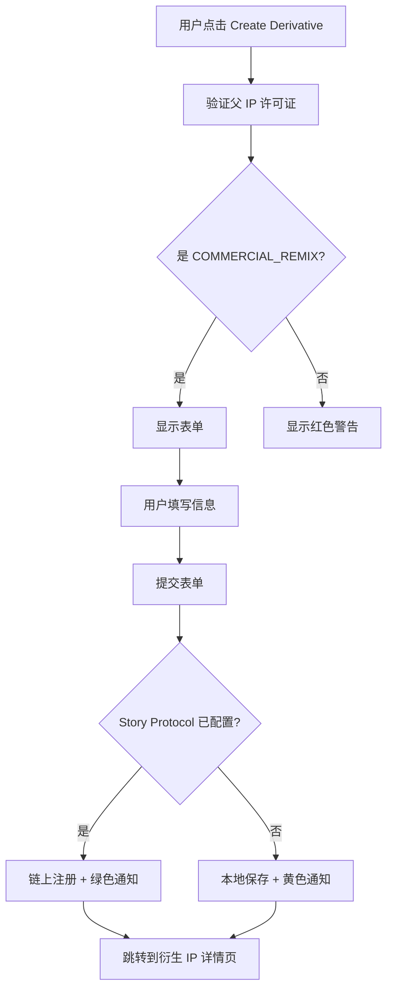
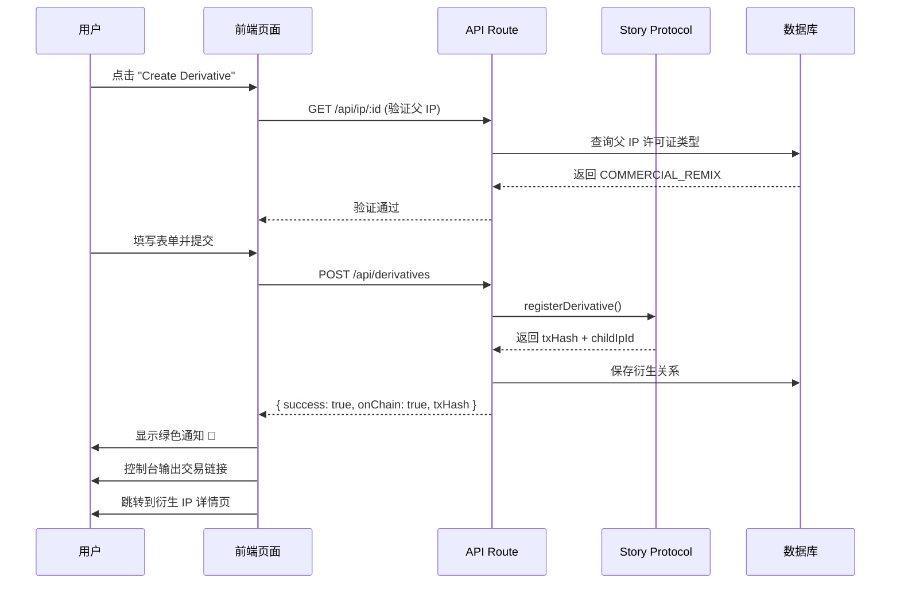
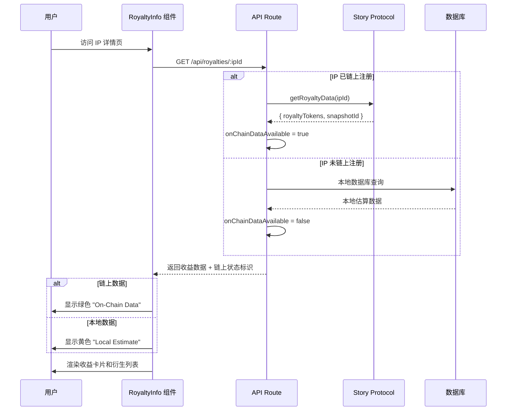

# 🎨 前端功能展示指南

## 一、衍生作品链上注册功能展现

### 📍 入口位置：`/create/derivative?parentId=xxx`

---

### 1.1 创建衍生作品页面

#### **页面结构：**

```
┌──────────────────────────────────────────────────────┐
│  ← Back to Parent IP                                 │
├──────────────────────────────────────────────────────┤
│  🌿 Create Derivative Work                           │
│  Register a new IP based on an existing work         │
├──────────────────────────────────────────────────────┤
│  【父 IP 信息卡片】                                   │
│  ┌────────────────────────────────────────────────┐ │
│  │ Creating derivative of:                        │ │
│  │  ┌────┐                                        │ │
│  │  │图片│ Original IP Title                      │ │
│  │  │    │ by Creator Name                        │ │
│  │  └────┘ 10% revenue share to original creator  │ │
│  └────────────────────────────────────────────────┘ │
├──────────────────────────────────────────────────────┤
│  【上传衍生作品】                                     │
│  ┌────────────────────────────────────────────────┐ │
│  │   📤                                           │ │
│  │   Click to upload your derivative work         │ │
│  └────────────────────────────────────────────────┘ │
├──────────────────────────────────────────────────────┤
│  Title: [输入框]                                     │
│  Description: [文本框]                               │
├──────────────────────────────────────────────────────┤
│  ✓ Attribution Required                             │
│  Your derivative work will be linked to the          │
│  original IP on-chain. Revenue sharing will be       │
│  automatically enforced via Story Protocol.          │
├──────────────────────────────────────────────────────┤
│  [ 🌿 Register Derivative Work ]                     │
└──────────────────────────────────────────────────────┘
```

---

### 1.2 关键视觉元素

#### **父 IP 信息卡片**（紫色主题）
```tsx
// 文件位置：app/create/derivative/page.tsx 第 172-190 行
<div className="bg-purple-500/10 border border-purple-500/20 rounded-xl p-4">
  <p className="text-sm text-purple-400">Creating derivative of:</p>
  <div className="flex items-center gap-4">
    
    <div>
      <h3>{parentIp.title}</h3>
      <p className="text-sm text-zinc-400">by {parentIp.creator?.name}</p>
      <p className="text-xs text-purple-400">
        {parentIp.commercialRevShare}% revenue share to original creator
      </p>
    </div>
  </div>
</div>
```

**视觉效果：**
- 🟣 紫色边框和背景，区别于其他功能
- 📸 展示父 IP 缩略图
- 💰 明确显示收益分成比例

---

#### **许可证验证提示**（红色警告）
```tsx
// 第 160-168 行
{validationError && (
  <div className="bg-red-500/10 border border-red-500/30 rounded-xl p-6">
    <div className="flex items-start gap-3">
      <AlertTriangle className="w-6 h-6 text-red-400" />
      <div>
        <h3 className="font-medium text-red-400">Cannot Create Derivative</h3>
        <p className="text-red-300/70">{validationError}</p>
      </div>
    </div>
  </div>
)}
```

**验证逻辑：**
- ✅ 只有 `COMMERCIAL_REMIX` 许可证允许创建衍生作品
- ❌ 其他许可证类型会显示错误提示

---

#### **链上注册成功提示**（通知系统）
```tsx
// 第 89-99 行
if (res.ok && data.success) {
  const message = data.onChain 
    ? '🎉 Derivative registered on Story Protocol! Transaction confirmed.'
    : '✅ Derivative saved locally. Configure Story Protocol for on-chain registration.';
  addNotification('success', message);
  
  if (data.txHash) {
    console.log('✅ Transaction Hash:', data.txHash);
    console.log('🔗 View on Explorer:', `https://aeneid.storyscan.xyz/tx/${data.txHash}`);
  }
}
```

**用户反馈：**
- 🎉 **链上注册成功**：绿色通知 + 交易哈希链接
- ✅ **本地保存**：黄色通知（未配置 Story Protocol 时的降级方案）

---

### 1.3 实际操作流程



---

## 二、收益数据链上同步展现

### 📍 展示位置：IP 详情页的 `RoyaltyInfo` 组件

---

### 2.1 收益信息卡片

#### **整体布局：**

```
┌──────────────────────────────────────────────────────┐
│  💰 Royalty Information     [ ✓ On-Chain Data ]      │
├──────────────────────────────────────────────────────┤
│  ┌──────────────┐  ┌──────────────┐                 │
│  │📈 Rev Share  │  │👥 Licenses   │                 │
│  │    10%       │  │      5       │                 │
│  └──────────────┘  └──────────────┘                 │
│  ┌──────────────┐  ┌──────────────┐                 │
│  │🌿 Derivatives│  │💰 Total Earned│                │
│  │      3       │  │  2.5 WIP     │                 │
│  └──────────────┘  └──────────────┘                 │
├──────────────────────────────────────────────────────┤
│  Revenue Breakdown                                   │
│  Direct Licenses ..................... 5             │
│  Derivative Royalties ................ 0.5000 WIP    │
├──────────────────────────────────────────────────────┤
│  🔗 Royalties from derivative works are              │
│     automatically distributed via Story Protocol     │
└──────────────────────────────────────────────────────┘
```

---

### 2.2 链上数据状态指示器

#### **On-Chain Data（绿色）**
```tsx
// 文件位置：components/RoyaltyInfo.tsx 第 73-87 行
{royaltyData.onChainDataAvailable !== undefined && (
  <div className="flex items-center gap-1.5 text-xs">
    {royaltyData.onChainDataAvailable ? (
      <>
        <CheckCircle className="w-3.5 h-3.5 text-green-400" />
        <span className="text-green-400 font-medium">On-Chain Data</span>
      </>
    ) : (
      <>
        <AlertCircle className="w-3.5 h-3.5 text-amber-400" />
        <span className="text-amber-400 font-medium">Local Estimate</span>
      </>
    )}
  </div>
)}
```

**视觉区分：**
- ✅ **On-Chain Data**（绿色）：数据从 Story Protocol 链上查询
- ⚠️ **Local Estimate**（黄色）：数据来自本地数据库估算

---

### 2.3 四大核心指标

#### **1. Revenue Share（收益分成比例）**
```tsx
// 第 91-100 行
<div className="bg-zinc-800/50 rounded-lg p-3">
  <div className="flex items-center gap-2 text-zinc-400 text-sm">
    <TrendingUp className="w-4 h-4" />
    Revenue Share
  </div>
  <p className="text-2xl font-bold text-white">
    {royaltyData.revSharePercentage}%
  </p>
</div>
```

---

#### **2. Licenses Sold（许可证销售数量）**
```tsx
// 第 102-111 行
<div className="bg-zinc-800/50 rounded-lg p-3">
  <div className="flex items-center gap-2 text-zinc-400 text-sm">
    <Users className="w-4 h-4" />
    Licenses Sold
  </div>
  <p className="text-2xl font-bold text-white">
    {royaltyData.totalLicensesSold}
  </p>
</div>
```

---

#### **3. Derivatives（衍生作品数量）**
```tsx
// 第 113-122 行
<div className="bg-zinc-800/50 rounded-lg p-3">
  <div className="flex items-center gap-2 text-zinc-400 text-sm">
    <GitBranch className="w-4 h-4" />
    Derivatives
  </div>
  <p className="text-2xl font-bold text-white">
    {royaltyData.derivativeCount}
  </p>
</div>
```

---

#### **4. Total Earned（累计收益）**
```tsx
// 第 124-133 行
<div className="bg-zinc-800/50 rounded-lg p-3">
  <div className="flex items-center gap-2 text-zinc-400 text-sm">
    <Coins className="w-4 h-4" />
    Total Earned
  </div>
  <p className="text-2xl font-bold text-indigo-400">
    {royaltyData.accumulatedRoyalties} {royaltyData.currency}
  </p>
</div>
```

**特殊样式：**
- 💰 累计收益使用 `text-indigo-400`（蓝紫色），突出显示

---

### 2.4 收益分解面板

```tsx
// 第 136-153 行
{(royaltyData.breakdown.directLicenses > 0 || 
  royaltyData.breakdown.derivativeRoyalties > 0) && (
  <div className="mt-4 pt-4 border-t border-white/10">
    <p className="text-xs text-zinc-400 mb-2">Revenue Breakdown</p>
    <div className="space-y-1.5">
      <div className="flex items-center justify-between text-sm">
        <span className="text-zinc-400">Direct Licenses</span>
        <span className="text-white font-medium">
          {royaltyData.breakdown.directLicenses}
        </span>
      </div>
      <div className="flex items-center justify-between text-sm">
        <span className="text-zinc-400">Derivative Royalties</span>
        <span className="text-indigo-400 font-medium">
          {royaltyData.breakdown.derivativeRoyalties.toFixed(4)} {royaltyData.currency}
        </span>
      </div>
    </div>
  </div>
)}
```

**数据来源：**
- **Direct Licenses**：直接购买许可证的数量
- **Derivative Royalties**：衍生作品自动分成的收益

---

### 2.5 衍生作品详细列表

```tsx
// 第 162-201 行
{royaltyData.derivatives && royaltyData.derivatives.length > 0 && (
  <div className="bg-zinc-900/50 border border-zinc-800 rounded-xl p-5">
    <h4 className="text-sm font-semibold text-white mb-3 flex items-center gap-2">
      <GitBranch className="w-4 h-4 text-purple-400" />
      Derivative Works ({royaltyData.derivatives.length})
    </h4>
    <div className="space-y-2">
      {royaltyData.derivatives.map((derivative, index) => (
        <div className="bg-zinc-800/30 rounded-lg p-3">
          <div className="flex items-center justify-between">
            <div>
              <p className="text-sm text-zinc-400">Derivative #{index + 1}</p>
              <p className="text-xs text-zinc-500 font-mono">
                {derivative.childIpId.slice(0, 8)}...{derivative.childIpId.slice(-6)}
              </p>
            </div>
            {derivative.txHash && (
              <a href={`https://aeneid.storyscan.xyz/tx/${derivative.txHash}`}
                 target="_blank"
                 className="text-indigo-400 hover:text-indigo-300">
                <ExternalLink className="w-4 h-4" />
              </a>
            )}
          </div>
          <p className="text-xs text-zinc-600 mt-1">
            Registered: {new Date(derivative.registeredAt).toLocaleDateString()}
          </p>
        </div>
      ))}
    </div>
  </div>
)}
```

**展示信息：**
- 📝 衍生作品编号
- 🔑 链上 IP ID（简化显示）
- 📅 注册日期
- 🔗 交易哈希链接（点击跳转到区块链浏览器）

---

## 三、IP 卡片链上状态徽章

### 📍 展示位置：市场浏览页 (`/explore`)

---

### 3.1 ON-CHAIN 徽章

```tsx
// 文件位置：components/IPCard.tsx 第 46-51 行
{asset.ipId && (
  <span className="bg-emerald-500/20 backdrop-blur-md border border-emerald-500/30 
                   text-emerald-400 text-[10px] font-bold px-2.5 py-1 rounded-full 
                   shadow-lg flex items-center gap-1">
    <CheckCircle className="w-3 h-3" />
    ON-CHAIN
  </span>
)}
```

**视觉效果：**
```
┌─────────────────────────────┐
│  ✓ ON-CHAIN    [LICENSE]    │  ← 卡片左上角
│                             │
│      [IP 作品图片]           │
│                             │
└─────────────────────────────┘
```

**显示逻辑：**
- ✅ 有 `ipId` 字段 = 已链上注册 → 显示绿色 ON-CHAIN 徽章
- ❌ 无 `ipId` 字段 = 仅本地保存 → 不显示徽章

---

## 四、数据流向图

### 4.1 衍生作品注册流程



---

### 4.2 收益数据同步流程



---

## 五、关键代码位置索引

| 功能 | 文件 | 关键代码行 |
|------|------|-----------|
| **衍生作品创建页面** | `app/create/derivative/page.tsx` | 1-308 |
| 父 IP 验证 | 同上 | 35-56 |
| 许可证类型检查 | 同上 | 45-47 |
| 链上注册提交 | 同上 | 66-110 |
| 成功通知差异化 | 同上 | 89-99 |
| **收益信息组件** | `components/RoyaltyInfo.tsx` | 1-205 |
| 链上状态指示器 | 同上 | 73-87 |
| 四大核心指标 | 同上 | 90-134 |
| 收益分解面板 | 同上 | 136-153 |
| 衍生作品列表 | 同上 | 162-201 |
| **IP 卡片组件** | `components/IPCard.tsx` | 1-93 |
| ON-CHAIN 徽章 | 同上 | 46-51 |

---

## 六、用户体验细节

### 6.1 颜色语言

| 功能状态 | 颜色 | 含义 |
|----------|------|------|
| 链上注册成功 | 🟢 绿色（emerald-400） | 数据已上链，完全去中心化 |
| 本地数据 | 🟡 黄色（amber-400） | 数据仅本地保存，未上链 |
| 衍生作品 | 🟣 紫色（purple-400） | 衍生关系标识 |
| 收益数据 | 🔵 蓝紫色（indigo-400） | 收益金额突出显示 |
| 错误警告 | 🔴 红色（red-400） | 不允许的操作 |

---

### 6.2 交互反馈

| 操作 | 反馈方式 |
|------|----------|
| 提交衍生作品 | 按钮显示加载动画 + 文字变为 "Registering Derivative..." |
| 注册成功（链上） | 绿色通知 + 交易哈希控制台输出 + 自动跳转 |
| 注册成功（本地） | 黄色通知 + 配置提示 + 自动跳转 |
| 许可证验证失败 | 红色警告框 + 禁用表单 |
| 查询收益数据 | 加载动画 → 数据卡片渐入 |
| 点击交易哈希 | 新标签页打开区块链浏览器 |

---

### 6.3 响应式设计

```css
/* 收益信息卡片 - 2x2 网格布局 */
grid-cols-2 gap-4

/* 移动端自适应 */
@media (max-width: 640px) {
  grid-cols-1 /* 变为单列 */
}
```

---

## 七、实际界面截图文字描述

### 7.1 衍生作品创建页面

```
标题区域：
  🌿 Create Derivative Work
  Register a new IP based on an existing work

父 IP 卡片（紫色渐变背景）：
  Creating derivative of:
  [缩略图] Original AI Portrait
          by Alice Chen
          10% revenue share to original creator

表单区域：
  - 上传区域（虚线边框，悬停变紫色）
  - 标题输入框（深色背景，紫色边框聚焦）
  - 描述文本框（多行输入）
  
提示区域（绿色对勾图标）：
  ✓ Attribution Required
  Your derivative work will be linked to the original IP on-chain.

提交按钮（紫色背景，全宽）：
  🌿 Register Derivative Work
```

---

### 7.2 收益信息卡片

```
标题栏：
  💰 Royalty Information          [ ✓ On-Chain Data ]
                                    (绿色，链上数据标识)

四宫格指标（深色背景）：
  ┌──────────────┬──────────────┐
  │ 📈 Rev Share │ 👥 Licenses  │
  │    10%       │      5       │
  ├──────────────┼──────────────┤
  │ 🌿 Derivatives│ 💰 Total    │
  │      3       │  2.5 WIP     │
  └──────────────┴──────────────┘

分割线

收益分解：
  Revenue Breakdown
  Direct Licenses ..................... 5
  Derivative Royalties ................ 0.5000 WIP
                                        (蓝紫色高亮)

提示信息（灰色小字）：
  🔗 Royalties from derivative works are automatically 
     distributed via Story Protocol

---

衍生作品列表（独立卡片，深色背景）：
  🌿 Derivative Works (3)
  
  [Derivative #1]
  0x1a2b3c4d...5e6f7g
  Registered: 12/1/2024        [🔗 外部链接图标]
  
  [Derivative #2]
  0x8h9i0j1k...2l3m4n
  Registered: 11/28/2024       [🔗]
```

---

## 八、性能优化

### 8.1 加载状态

```tsx
// RoyaltyInfo.tsx 第 53-59 行
if (isLoading) {
  return (
    <div className="flex items-center justify-center py-6">
      <Loader2 className="w-6 h-6 text-indigo-500 animate-spin" />
    </div>
  );
}
```

**加载流程：**
1. 用户访问 IP 详情页
2. 显示旋转加载图标（蓝紫色）
3. 数据获取完成后淡入显示卡片

---

### 8.2 错误降级

```tsx
// 第 61-63 行
if (!royaltyData) {
  return null; // 数据获取失败时不显示组件
}
```

**容错策略：**
- API 失败不影响页面其他部分
- 链上查询失败时自动使用本地数据
- 用户无感知降级

---

## 九、开发者调试信息

### 9.1 控制台输出

```javascript
// 衍生作品注册成功时
console.log('✅ Transaction Hash:', data.txHash);
console.log('🔗 View on Explorer:', `https://aeneid.storyscan.xyz/tx/${data.txHash}`);
```

**输出示例：**
```
✅ Transaction Hash: 0x1a2b3c4d5e6f7g8h9i0j1k2l3m4n5o6p7q8r9s0t1u2v3w4x5y6z7a8b9c0d1e2f
🔗 View on Explorer: https://aeneid.storyscan.xyz/tx/0x1a2b3c4d...
```

---

## 十、总结

### ✅ 衍生作品链上注册 - 前端展现

1. **表单验证**：红色警告提示不允许的许可证类型
2. **父 IP 信息**：紫色卡片展示原作信息和收益分成
3. **提交反馈**：差异化通知（链上=绿色，本地=黄色）
4. **交易追踪**：控制台输出区块链浏览器链接

---

### ✅ 收益数据链上同步 - 前端展现

1. **状态指示器**：绿色 "On-Chain Data" vs 黄色 "Local Estimate"
2. **核心指标**：4 个卡片展示收益、许可证、衍生作品、累计收益
3. **收益分解**：区分直接许可和衍生分成
4. **衍生列表**：展示所有衍生作品 + 交易哈希链接
5. **实时查询**：优先查询链上数据，失败时降级到本地

---

**视觉设计原则：**
- 🟢 链上数据 = 绿色（信任、去中心化）
- 🟡 本地数据 = 黄色（警告、临时）
- 🟣 衍生关系 = 紫色（连接、创意）
- 🔵 收益金额 = 蓝紫色（价值、突出）

**用户体验核心：**
- ✅ 清晰的状态反馈
- ✅ 透明的数据来源标识
- ✅ 可追溯的交易链接
- ✅ 优雅的错误降级
